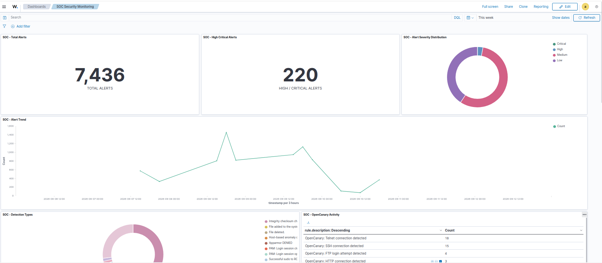
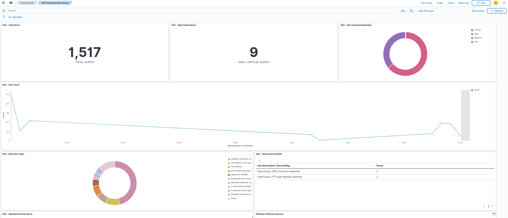
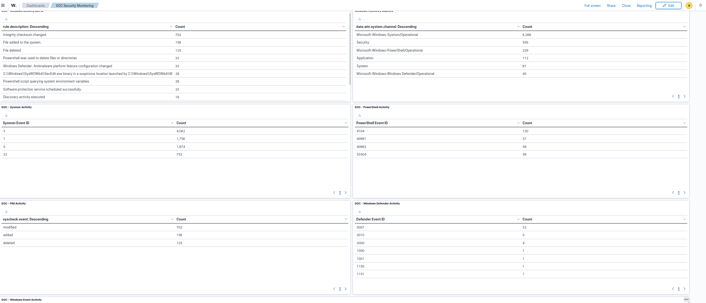
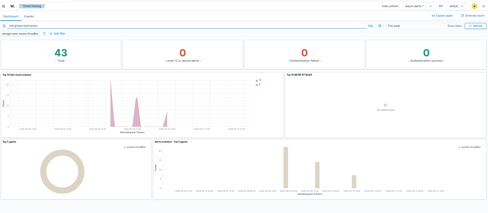

# 🔐 SOC Monitoring & Threat Detection Lab

A hands-on **Security Operations Center (SOC) monitoring and threat detection lab** built using **Wazuh, OpenCanary, Sysmon, and Windows security telemetry** in an isolated virtualized environment.

The project demonstrates how security events from a honeypot and Windows endpoint can be centrally collected, monitored, investigated, and detected using Wazuh.

---

## 🎯 Project Overview

This project simulates a small SOC environment where:

- **Kali Linux** acts as the attacker/security testing machine.
- **Ubuntu** hosts the Wazuh Manager, Wazuh Indexer, Wazuh Dashboard, and OpenCanary.
- **Windows 11** acts as the monitored endpoint.
- **Wazuh Agent** forwards Windows security telemetry to the Wazuh Manager.
- **OpenCanary** detects interactions with simulated services.
- **Sysmon** provides detailed Windows system and network telemetry.
- **Wazuh FIM** monitors file changes.
- **PowerShell Script Block Logging** provides PowerShell activity visibility.
- **Windows Defender** provides endpoint security telemetry.
- **Wazuh Dashboard** provides centralized monitoring and investigation.

---

## 🏗️ Architecture

```text
                         ┌───────────────────┐
                         │    Kali Linux     │
                         │ Attacker / Testing│
                         └─────────┬─────────┘
                                   │
                    Controlled Security Testing
                                   │
                 ┌─────────────────┴─────────────────┐
                 │                                   │
                 ▼                                   ▼
        ┌───────────────────┐              ┌───────────────────┐
        │ Ubuntu            │              │ Windows 11        │
        │                   │              │                   │
        │ OpenCanary        │              │ Wazuh Agent       │
        │ Wazuh Manager     │              │ Sysmon            │
        │ Wazuh Indexer     │              │ PowerShell        │
        │ Wazuh Dashboard   │              │ Windows Defender  │
        │                   │              │ Security Events   │
        └─────────┬─────────┘              │ FIM               │
                  │                        └─────────┬─────────┘
                  │                                  │
                  │                                  │
                  └──────────────┬───────────────────┘
                                 │
                                 ▼
                       ┌───────────────────┐
                       │  Wazuh Dashboard  │
                       │                   │
                       │ Alerts            │
                       │ Archives          │
                       │ Investigation     │
                       │ SOC Monitoring    │
                       └───────────────────┘
```

---

## 🛠️ Technologies Used

| Technology | Purpose |
|---|---|
| **Wazuh** | Security monitoring, event analysis, and detection |
| **OpenCanary** | Honeypot and service interaction detection |
| **Sysmon** | Windows system and network telemetry |
| **Windows 11** | Monitored endpoint |
| **Kali Linux** | Security testing / attacker simulation |
| **PowerShell** | Endpoint activity and Script Block Logging |
| **Windows Defender** | Endpoint security telemetry |
| **VirtualBox** | Isolated virtual lab environment |

---

## 🔎 Monitoring Components

### 🪤 OpenCanary

OpenCanary was configured as a honeypot with simulated services:

- **FTP** — Port `2121`
- **SSH** — Port `2222`
- **Telnet** — Port `2323`
- **HTTP** — Port `8888`

Interactions with these services generate OpenCanary logs, which are collected by Wazuh and processed using custom detection rules.

---

### 🖥️ Windows Endpoint

The Windows endpoint sends security telemetry to the Wazuh Manager through the Wazuh Agent.

Collected sources include:

- Windows Security
- System
- Windows Application Event Log
- Windows Defender
- PowerShell
- Sysmon

---

### 🔍 Sysmon

Sysmon provides detailed Windows telemetry.

The project specifically verified telemetry including:

- **Event ID 3** — Network Connection
- **Event ID 22** — DNS Query
- Other Sysmon events collected through Wazuh Archives

---

### 📁 File Integrity Monitoring

Wazuh FIM monitors selected Windows directories for file changes.

Verified FIM activity includes:

- File modification
- File creation
- File deletion

---

### ⚡ PowerShell Monitoring

PowerShell Script Block Logging was enabled to collect PowerShell operational events.

**Event ID 4104** was verified in Wazuh Archives.

---

### 🛡️ Windows Defender

Windows Defender operational events are collected by the Wazuh Agent.

A Defender Quick Scan was performed, and the resulting telemetry was successfully received by Wazuh.

---

## 🚨 Alerts vs Archives

An important part of this project is the distinction between **alerts** and **archives**.

### Wazuh Alerts

```text
Event / Log
     ↓
Wazuh Rule Engine
     ↓
Rule Match
     ↓
Alert Generated
```

The `wazuh-alerts-*` index contains events that triggered Wazuh detection rules.

### Wazuh Archives

```text
Event / Log
     ↓
Wazuh
     ↓
Archive
```

The `wazuh-archives-*` index provides broader event visibility, including telemetry that may not have generated an alert.

This allows the SOC analyst to use:

- **Alerts → Detection**
- **Archives → Investigation / Telemetry**

---

## 📊 SOC Dashboard

The project includes a custom Wazuh SOC dashboard containing:

- Total Alerts
- High/Critical Alerts
- Alert Severity Distribution
- Alert Trend
- Detection Types
- OpenCanary Activity
- Windows Security Alerts
- Windows Telemetry Sources
- Sysmon Activity
- PowerShell Activity
- FIM Activity
- Windows Defender Activity
- Windows Event Activity

The dashboard also supports filtering for investigation, including agent and OpenCanary activity.

---

## 🧪 Attack & Detection Testing

Security testing was performed from Kali Linux against the isolated lab environment.

### Verified OpenCanary Scenarios

- HTTP interaction
- SSH connection
- FTP login attempt
- Telnet connection

### Verified Windows Telemetry

Controlled testing was performed for:

- DNS queries
- Network connections
- File changes
- PowerShell activity
- Windows Defender scanning
- Windows security events

---

## 🚨 Custom Wazuh Detection Rules

Custom Wazuh rules were created to detect OpenCanary activity and generate centralized security alerts.

| Detection | Rule ID |
|---|---:|
| OpenCanary SSH connection | `100501` |
| OpenCanary FTP login attempt | `100502` |
| OpenCanary Telnet connection | `100503` |
| OpenCanary HTTP connection | Custom OpenCanary HTTP rule |

These rules allow OpenCanary events to become Wazuh alerts for centralized SOC monitoring.

---

## 📸 Screenshots

The following screenshots demonstrate the implemented SOC monitoring and detection workflow:


### 📊 SOC Dashboard



### 🪤 OpenCanary Dashboard



### 🖥️ Windows Security Dashboard



### 🚨 OpenCanary Alerts



---

## 🔄 Detection Flow

### OpenCanary Detection

```text
Kali Linux
    ↓
Connection to Honeypot Service
    ↓
OpenCanary
    ↓
OpenCanary Log
    ↓
Wazuh Manager
    ↓
Custom Detection Rule
    ↓
Wazuh Alert
    ↓
Wazuh Dashboard
```

### Windows Telemetry Flow

```text
Windows 11
    ↓
Wazuh Agent
    ↓
Windows Event Sources
    ├── Security
    ├── System
    ├── Application
    ├── Sysmon
    ├── PowerShell
    ├── Defender
    └── FIM
    ↓
Wazuh Manager
    ↓
    ┌─────────────┴─────────────┐
    ↓                           ↓
Archives                      Rules
    ↓                           ↓
Telemetry                    Alerts
    └─────────────┬─────────────┘
                  ↓
           Wazuh Dashboard
```

---

## 🔐 Security & Lab Disclaimer

This project was developed in an isolated virtualized lab environment for educational and defensive security monitoring purposes.

Testing was performed only against systems controlled by the project author.

No unauthorized systems or services were targeted.

---


## 👩‍💻 Author

**Anusha Peddapalli**

Cybersecurity | SOC | Threat Detection | Security Monitoring
